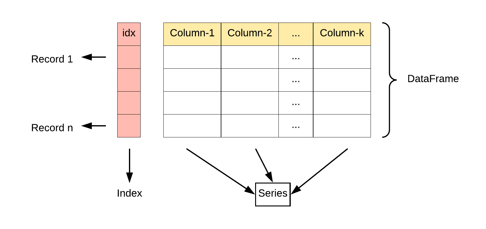

# PandasStudy

Pandas的主要数据结构是Series（一维数据结构）与DataFrame（二维数据），这两种数据结构足以处理金融、统计、社会科学、工程等领域里的大多数典型用例。

## Pandas 数据结构 - Series

类似于表格中的一个列（column），类似于一维数组，可以保存任何数据类型。

函数：

`pandas.Series(data, index, dtype, name, copy)`

+ data：一组数据
+ index：数据索引标签，如果不指定默认从0开始
+ dtype：数据类型，默认会自己判断
+ name：设置名称
+ copy：拷贝数据，默认为False

```python
>>> import pandas as pd
>>> a = ['zzm', 'rzy', 'zky']
>>> myvar = pd.Series(a, index = ['x', 'y', 'z'])
>>> print(myvar)
x    zzm
y    rzy
z    zky
dtype: object
```

也可以使用字典对象，类似字典来创建Series

```python
>>> import pandas as pd
>>> sites = {1: "Google", 2: "Runoob", 3: "Wiki"}
>>> myvar = pd.Series(sites)
>>> print(myvar)
1    Google
2    Runoob
3      Wiki
dtype: object
```

如果我们只需要字典中的一部分数据，只需要指定需要数据的索引即可。

```python
import pandas as pd

sites = {1: "Google", 2: "Runoob", 3: "Wiki"}

myvar = pd.Series(sites, index = [1, 2])

print(myvar)
```

设置Series名称参数

```python
>>> sites = {1: "Google", 2: "Runoob", 3: "Wiki"}
>>> myvar = pd.Series(sites, index = [1, 2], name="TEST")
>>> print(myvar)
1    Google
2    Runoob
Name: TEST, dtype: object
```

## Pandas 数据结构 - DataFrame

DataFrame是一个表格型的数据结构，它含有一组有序的列，每列可以是不同的值类型。可以认为，这个表格的每一列是一个Series。




DataFrame构造方法如下：

`pandas.DataFrame( data, index, columns, dtype, copy)`

参数说明：

- **data**：一组数据(ndarray、series, map, lists, dict 等类型)。
- **index**：索引值.
- **columns**：列标签.
- **dtype**：数据类型。
- **copy**：拷贝数据，默认为 False。

### 用Serie生成DataFrame

生成的**行索引**是每个 **Series** 索引的并集。先把嵌套字典转换为 Series。如果没有指定列，DataFrame 的列就是字典键的有序列表。

```python
In [37]: d = {'one': pd.Series([1., 2., 3.], index=['a', 'b', 'c']),
   ....:      'two': pd.Series([1., 2., 3., 4.], index=['a', 'b', 'c', 'd'])}
   ....: 

In [38]: df = pd.DataFrame(d)

In [39]: df
Out[39]: 
   one  two
a  1.0  1.0
b  2.0  2.0
c  3.0  3.0
d  NaN  4.0

In [40]: pd.DataFrame(d, index=['d', 'b', 'a'])
Out[40]: 
   one  two
d  NaN  4.0
b  2.0  2.0
a  1.0  1.0

In [41]: pd.DataFrame(d, index=['d', 'b', 'a'], columns=['two', 'three'])
Out[41]: 
   two three
d  4.0   NaN
b  2.0   NaN
a  1.0   NaN
```

用 Series 字典对象生成 DataFrame：

```python
In [9]: df2 = pd.DataFrame({'A': 1.,
   ...:                     'B': pd.Timestamp('20130102'),
   ...:                     'C': pd.Series(1, index=list(range(4)), dtype='float32'),
   ...:                     'D': np.array([3] * 4, dtype='int32'),
   ...:                     'E': pd.Categorical(["test", "train", "test", "train"]),
   ...:                     'F': 'foo'})
   ...: 

In [10]: df2
Out[10]: 
     A          B    C  D      E    F
0  1.0 2013-01-02  1.0  3   test  foo
1  1.0 2013-01-02  1.0  3  train  foo
2  1.0 2013-01-02  1.0  3   test  foo
3  1.0 2013-01-02  1.0  3  train  foo
```

DataFrame的列有不同的数据类型

```python
In [11]: df2.dtypes
Out[11]: 
A           float64
B    datetime64[ns]
C           float32
D             int32
E          category
F            object
dtype: object
```

### 查看数据

查看DataFrame头部和尾部数据

```python
In [13]: df.head()
Out[13]: 
                   A         B         C         D
2013-01-01  0.469112 -0.282863 -1.509059 -1.135632
2013-01-02  1.212112 -0.173215  0.119209 -1.044236
2013-01-03 -0.861849 -2.104569 -0.494929  1.071804
2013-01-04  0.721555 -0.706771 -1.039575  0.271860
2013-01-05 -0.424972  0.567020  0.276232 -1.087401

In [14]: df.tail(3)
Out[14]: 
                   A         B         C         D
2013-01-04  0.721555 -0.706771 -1.039575  0.271860
2013-01-05 -0.424972  0.567020  0.276232 -1.087401
2013-01-06 -0.673690  0.113648 -1.478427  0.524988
```

显示索引与列名

```python
In [15]: df.index
Out[15]: 
DatetimeIndex(['2013-01-01', '2013-01-02', '2013-01-03', '2013-01-04',
               '2013-01-05', '2013-01-06'],
              dtype='datetime64[ns]', freq='D')

In [16]: df.columns
Out[16]: Index(['A', 'B', 'C', 'D'], dtype='object')
```

describe()可以快速查看数据的统计摘要：

```python
In [19]: df.describe()
Out[19]: 
              A         B         C         D
count  6.000000  6.000000  6.000000  6.000000
mean   0.073711 -0.431125 -0.687758 -0.233103
std    0.843157  0.922818  0.779887  0.973118
min   -0.861849 -2.104569 -1.509059 -1.135632
25%   -0.611510 -0.600794 -1.368714 -1.076610
50%    0.022070 -0.228039 -0.767252 -0.386188
75%    0.658444  0.041933 -0.034326  0.461706
max    1.212112  0.567020  0.276232  1.071804
```

转置数据 

```python
In [20]: df.T
Out[20]: 
   2013-01-01  2013-01-02  2013-01-03  2013-01-04  2013-01-05  2013-01-06
A    0.469112    1.212112   -0.861849    0.721555   -0.424972   -0.673690
B   -0.282863   -0.173215   -2.104569   -0.706771    0.567020    0.113648
C   -1.509059    0.119209   -0.494929   -1.039575    0.276232   -1.478427
D   -1.135632   -1.044236    1.071804    0.271860   -1.087401    0.524988
```

按轴（索引）排序

```python
In [21]: df.sort_index(axis=1, ascending=False) # axis: 0表示按index，1表示按columns
Out[21]: 
                   D         C         B         A
2013-01-01 -1.135632 -1.509059 -0.282863  0.469112
2013-01-02 -1.044236  0.119209 -0.173215  1.212112
2013-01-03  1.071804 -0.494929 -2.104569 -0.861849
2013-01-04  0.271860 -1.039575 -0.706771  0.721555
2013-01-05 -1.087401  0.276232  0.567020 -0.424972
2013-01-06  0.524988 -1.478427  0.113648 -0.673690
```

按值排序

```python
In [22]: df.sort_values(by='B')
Out[22]: 
                   A         B         C         D
2013-01-03 -0.861849 -2.104569 -0.494929  1.071804
2013-01-04  0.721555 -0.706771 -1.039575  0.271860
2013-01-01  0.469112 -0.282863 -1.509059 -1.135632
2013-01-02  1.212112 -0.173215  0.119209 -1.044236
2013-01-06 -0.673690  0.113648 -1.478427  0.524988
2013-01-05 -0.424972  0.567020  0.276232 -1.087401
```

## 选择数据

选择单列，产生`Series`

```python
In [23]: df['A'] # 与df.A等效
Out[23]: 
2013-01-01    0.469112
2013-01-02    1.212112
2013-01-03   -0.861849
2013-01-04    0.721555
2013-01-05   -0.424972
2013-01-06   -0.673690
Freq: D, Name: A, dtype: float64
```

用[]切片行

```python
In [24]: df[0:3]
Out[24]: 
                   A         B         C         D
2013-01-01  0.469112 -0.282863 -1.509059 -1.135632
2013-01-02  1.212112 -0.173215  0.119209 -1.044236
2013-01-03 -0.861849 -2.104569 -0.494929  1.071804

In [25]: df['20130102':'20130104']
Out[25]: 
                   A         B         C         D
2013-01-02  1.212112 -0.173215  0.119209 -1.044236
2013-01-03 -0.861849 -2.104569 -0.494929  1.071804
2013-01-04  0.721555 -0.706771 -1.039575  0.271860
```

